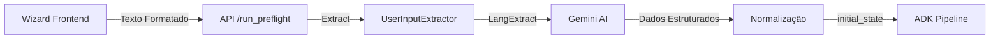

# Refatoração de Campos de Entrada - Sistema Wizard Instagram Ads

## Sumário Executivo

Este documento apresenta uma análise técnica completa do sistema de entrada de dados do projeto Instagram Ads, focando na arquitetura do wizard frontend, processamento backend e integração com o pipeline ADK. O objetivo é fornecer uma base sólida para a implementação de novos campos de entrada necessários para o sistema de fallback do StoryBrand.

## 1. Arquitetura Geral do Sistema

### 1.1 Visão de Alto Nível



### 1.2 Stack Tecnológico

- **Frontend**: React + TypeScript + Vite
- **API**: FastAPI (Python 3.10+)
- **Extração**: LangExtract + Gemini 2.5 Flash
- **Pipeline**: Google ADK (Agent Development Kit)

## 2. Estrutura de Dados Atual

### 2.1 Schema do Frontend

**Arquivo**: `frontend/src/types/wizard.types.ts`

```typescript
export interface WizardFormState {
  landing_page_url: string;  // URL da página de destino
  objetivo_final: string;     // Meta da campanha
  formato_anuncio: string;    // Feed/Stories/Reels
  perfil_cliente: string;     // Descrição do público-alvo
  foco: string;              // Tema/gancho opcional
}
```

### 2.2 Schema do Backend

**Arquivo**: `helpers/user_extract_data.py:181-191`

```python
data: Dict[str, Optional[str]] = {
    "landing_page_url": None,
    "objetivo_final": None,
    "perfil_cliente": None,
    "formato_anuncio": None,
    "foco": None,
}

normalized: Dict[str, Optional[str]] = {
    "formato_anuncio_norm": None,  # Feed/Stories/Reels
    "objetivo_final_norm": None,    # agendamentos/leads/vendas/contato
}
```

### 2.3 Estado Inicial ADK

**Arquivo**: `app/server.py:221-233`

```python
initial_state = {
    "landing_page_url": str,
    "objetivo_final": str,        # Versão normalizada
    "perfil_cliente": str,
    "formato_anuncio": str,       # Feed/Stories/Reels
    "foco": str,                  # Opcional
    "implementation_plan": dict,   # Plano fixo por formato
    "format_specs": dict,          # Especificações do formato
    "format_specs_json": str,      # JSON serializado
    "planning_mode": "fixed",      # Sinaliza uso de plano fixo
}
```

## 3. Fluxo Detalhado de Dados

### 3.1 Etapa 1: Coleta no Frontend

#### 3.1.1 Inicialização do Wizard

**Arquivo**: `frontend/src/constants/wizard.constants.ts`

```typescript
// Estado inicial vazio
export const WIZARD_INITIAL_STATE: WizardFormState = {
  landing_page_url: '',
  objetivo_final: '',
  formato_anuncio: '',
  perfil_cliente: '',
  foco: '',
};

// Definição dos 6 passos
export const WIZARD_STEPS: WizardStep[] = [
  {
    id: 'landing_page_url',
    title: 'Qual é a página de destino?',
    validationRules: [...],
    // ...
  },
  // ... outros steps
  {
    id: 'review',
    title: 'Revise antes de gerar',
    // Step final sem campo associado
  }
];
```

#### 3.1.2 Componente Principal

**Arquivo**: `frontend/src/components/WizardForm/WizardForm.tsx`

Fluxo de interação:
1. **Navegação**: `goToStep()` controla o step atual
2. **Validação**: `validateStepField()` valida campo por campo
3. **Submissão**: `handleSubmit()` valida todos os campos e formata

#### 3.1.3 Formatação para Envio

**Arquivo**: `frontend/src/utils/wizard.utils.ts:107-123`

```typescript
export function formatSubmitPayload(formState: WizardFormState): string {
  const lines = WIZARD_STEPS.flatMap(step => {
    if (step.id === 'review') {
      return [];
    }

    const fieldId = step.id as keyof WizardFormState;
    const value = formState[fieldId].trim();
    if (!value) {
      return [];
    }

    return [`${fieldId}: ${value}`];
  });

  return lines.join('\n');
}
```

**Exemplo de saída**:
```
landing_page_url: https://example.com/promo
objetivo_final: agendamentos
formato_anuncio: Reels
perfil_cliente: Executivos 35-50 anos que buscam emagrecimento
foco: Promoção de inverno
```

### 3.2 Etapa 2: Envio e Recepção na API

#### 3.2.1 Chamada do Frontend

**Arquivo**: `frontend/src/App.tsx:135-152`

```typescript
const runPreflight = async (text: string): Promise<...> => {
  const resp = await fetch(`/api/run_preflight`, {
    method: "POST",
    headers: { "Content-Type": "application/json" },
    body: JSON.stringify({ text })
  });
  // ... tratamento de resposta
}
```

#### 3.2.2 Endpoint FastAPI

**Arquivo**: `app/server.py:109-250`

```python
@app.post("/run_preflight")
def run_preflight(payload: dict = Body(...)) -> dict:
    # 1. Extrai texto do payload
    text = payload.get("text")

    # 2. Chama extrator
    result = extract_user_input(text)

    # 3. Valida campos obrigatórios
    if not result.get("success"):
        raise HTTPException(status_code=422, detail={...})

    # 4. Seleciona plano fixo por formato
    plan = get_fixed_plan(formato)
    specs = get_format_specifications(formato)

    # 5. Monta estado inicial
    initial_state = {
        "landing_page_url": data.get("landing_page_url"),
        "objetivo_final": normalized.get("objetivo_final_norm"),
        # ... outros campos
        "implementation_plan": plan,
        "planning_mode": "fixed"
    }

    return {
        "success": True,
        "initial_state": initial_state,
        "plan_summary": {...}
    }
```

### 3.3 Etapa 3: Extração e Normalização

#### 3.3.1 UserInputExtractor

**Arquivo**: `helpers/user_extract_data.py:40-200`

```python
class UserInputExtractor:
    def __init__(self, model_id: str = "gemini-2.5-flash"):
        self.prompt = (
            "From the user text below, extract exactly these fields if present: "
            "landing_page_url (http/https), objetivo_final, perfil_cliente, "
            "formato_anuncio, foco. Use exact user wording for values when present."
        )

    def extract(self, raw_text: str) -> Dict[str, Any]:
        # 1. Chama LangExtract com Gemini
        result = lx.extract(
            text_or_documents=raw_text,
            prompt_description=self.prompt,
            examples=self._examples(),
            model_id=self.model_id,
            extraction_passes=1,
            max_workers=4,
            max_char_buffer=1800,
            use_schema_constraints=True
        )

        # 2. Converte resultado
        return self._convert(result)
```

#### 3.3.2 Processo de Normalização

```python
def _convert(self, langextract_result: Any) -> Dict[str, Any]:
    # Mapeia extrações para campos
    data = {"landing_page_url": None, ...}
    normalized = {}

    for ext in langextract_result.extractions:
        cls = ext.extraction_class
        txt = ext.extraction_text
        attrs = ext.attributes or {}

        # Salva valor extraído
        if cls in data:
            data[cls] = txt

        # Aplica normalização se disponível
        if "normalized" in attrs:
            if cls == "formato_anuncio":
                normalized["formato_anuncio_norm"] = attrs["normalized"]
            elif cls == "objetivo_final":
                normalized["objetivo_final_norm"] = attrs["normalized"]

    return {
        "success": bool(data["landing_page_url"] and data["objetivo_final"]),
        "data": data,
        "normalized": normalized,
        "errors": [...] # Lista de campos faltantes
    }
```

### 3.4 Etapa 4: Integração com ADK Pipeline

#### 3.4.1 Criação da Sessão

**Arquivo**: `frontend/src/App.tsx:391-411`

```typescript
// 1. Executa preflight
const preflight = await runPreflight(query);
initialState = preflight?.initial_state || {};

// 2. Cria sessão ADK com estado inicial
const sessionData = await createSession(initialState);

// 3. Executa pipeline com SSE
const response = await fetch(`/api/run_sse`, {
  method: 'POST',
  headers: { 'Content-Type': 'application/json' },
  body: JSON.stringify({
    appName: currentAppName,
    userId: currentUserId,
    sessionId: currentSessionId,
    newMessage: { parts: [{ text: query }] }
  })
});
```

#### 3.4.2 Consumo no Pipeline

**Arquivo**: `app/agent.py:626-688`

```python
landing_page_analyzer = LlmAgent(
    name="landing_page_analyzer",
    # Usa landing_page_url do estado
    system_prompt="""...""",
    output_key="landing_page_context"
)

context_synthesizer = LlmAgent(
    name="context_synthesizer",
    # Usa todos os campos do estado
    system_prompt="""
    - objetivo_final: {objetivo_final}
    - perfil_cliente: {perfil_cliente}
    - landing_page_context: {landing_page_context}
    - storybrand_analysis: {storybrand_analysis}
    """
)
```

## 4. Validações e Regras de Negócio

### 4.1 Validações no Frontend

**Arquivo**: `frontend/src/constants/wizard.constants.ts:43-152`

```typescript
// Validação de URL
{
  field: 'landing_page_url',
  validate: value => {
    const trimmedValue = value.trim();
    if (!trimmedValue) {
      return 'Informe a URL da página de destino.';
    }
    try {
      const parsedUrl = new URL(trimmedValue);
      if (!['http:', 'https:'].includes(parsedUrl.protocol)) {
        return 'Utilize URLs iniciadas com http:// ou https://';
      }
    } catch (error) {
      return 'Digite uma URL válida, incluindo http(s)://';
    }
    return null;
  }
}

// Validação de objetivo com valores controlados
{
  field: 'objetivo_final',
  validate: value => {
    const objetivoValues = new Set(['agendamentos', 'leads', 'vendas', 'contato']);
    if (!objetivoValues.has(value)) {
      return 'Escolha um objetivo disponível na lista.';
    }
    return null;
  }
}

// Validação de perfil_cliente (20-500 caracteres)
{
  field: 'perfil_cliente',
  validate: value => {
    const trimmed = value.trim();
    if (trimmed.length < 20) {
      return 'Use pelo menos 20 caracteres para detalhar o público.';
    }
    if (trimmed.length > 500) {
      return 'Resuma o perfil em no máximo 500 caracteres.';
    }
    return null;
  }
}
```

### 4.2 Validações no Backend

**Arquivo**: `app/server.py:168-198`

```python
# Campos obrigatórios
required = ["landing_page_url", "objetivo_final", "formato_anuncio", "perfil_cliente"]
errors = []

for field in required:
    if not data.get(field):
        errors.append({
            "field": field,
            "message": f"Campo obrigatório: {field}"
        })

# Normalização obrigatória para formato
if not norm.get("formato_anuncio_norm"):
    errors.append({
        "field": "formato_anuncio",
        "message": "Formato deve ser Feed, Stories ou Reels"
    })

if errors:
    raise HTTPException(
        status_code=422,
        detail={"message": "Campos obrigatórios faltantes", "errors": errors}
    )
```

## 5. Guia de Implementação de Novos Campos

### 5.1 Requisitos do Plano de Fallback StoryBrand

Novos campos necessários:
- `nome_empresa`: Nome da empresa anunciante
- `o_que_a_empresa_faz`: Breve descrição do negócio
- `sexo_cliente_alvo`: masculino/feminino/neutro

### 5.2 Implementação no Frontend

#### 5.2.1 Atualizar Types

**Arquivo**: `frontend/src/types/wizard.types.ts`

```typescript
export interface WizardFormState {
  // Campos existentes...
  landing_page_url: string;
  objetivo_final: string;
  formato_anuncio: string;
  perfil_cliente: string;
  foco: string;
  // NOVOS CAMPOS
  nome_empresa: string;
  o_que_a_empresa_faz: string;
  sexo_cliente_alvo: string;
}

export interface WizardValidationErrors {
  // Adicionar correspondentes...
  nome_empresa?: string;
  o_que_a_empresa_faz?: string;
  sexo_cliente_alvo?: string;
}
```

#### 5.2.2 Atualizar Constants

**Arquivo**: `frontend/src/constants/wizard.constants.ts`

```typescript
// Flag de rollout (build-time)
export const ENABLE_NEW_FIELDS = import.meta.env.VITE_ENABLE_NEW_FIELDS === 'true';

export const WIZARD_INITIAL_STATE: WizardFormState = {
  // Existentes...
  landing_page_url: '',
  objetivo_final: '',
  formato_anuncio: '',
  perfil_cliente: '',
  foco: '',
  // NOVOS
  nome_empresa: '',
  o_que_a_empresa_faz: '',
  sexo_cliente_alvo: '',
};

// Adicionar opções controladas
export const SEXO_CLIENTE_OPTIONS = [
  { value: 'masculino', label: 'Masculino', description: 'Público predominantemente masculino' },
  { value: 'feminino', label: 'Feminino', description: 'Público predominantemente feminino' },
  { value: 'neutro', label: 'Neutro/Misto', description: 'Público diversificado' },
] as const;

// Adicionar novos steps após landing_page_url
const BASE_STEPS: WizardStep[] = [
  {
    id: 'landing_page_url',
    // ...existente
  },
  // ...steps existentes até 'review'
];

// Steps adicionais condicionados à flag
const EXTRA_STEPS: WizardStep[] = [
  // NOVO STEP 2
  {
    id: 'nome_empresa',
        title: 'Qual é o nome da empresa?',
    subtitle: 'Passo 2',
    description: 'Informe o nome da empresa anunciante',
        icon: Building2, // usar Building2 para compatibilidade com lucide-react
    validationRules: [
      {
        field: 'nome_empresa',
        validate: value => {
          const trimmed = value.trim();
          if (!trimmed) {
            return 'Informe o nome da empresa.';
          }
          if (trimmed.length < 2) {
            return 'Nome muito curto.';
          }
          if (trimmed.length > 100) {
            return 'Nome muito longo (máximo 100 caracteres).';
          }
          return null;
        },
      },
    ],
  },
  // NOVO STEP 3
  {
    id: 'o_que_a_empresa_faz',
    title: 'O que a empresa faz?',
    subtitle: 'Passo 3',
    description: 'Descreva brevemente o negócio ou serviço principal',
        icon: Briefcase,
    validationRules: [
      {
        field: 'o_que_a_empresa_faz',
        validate: value => {
          const trimmed = value.trim();
          if (!trimmed) {
            return 'Descreva o que a empresa faz.';
          }
          if (trimmed.length < 10) {
            return 'Descrição muito curta (mínimo 10 caracteres).';
          }
          if (trimmed.length > 200) {
            return 'Descrição muito longa (máximo 200 caracteres).';
          }
          return null;
        },
      },
    ],
  },
  // Ajustar numeração dos steps existentes...
  {
    id: 'objetivo_final',
    subtitle: 'Passo 4', // Era passo 2
    // ...
  },
  // NOVO STEP para sexo_cliente_alvo (após perfil_cliente)
  {
    id: 'sexo_cliente_alvo',
    title: 'Qual o gênero predominante?',
    subtitle: 'Passo 7',
    description: 'Selecione o gênero predominante do público-alvo para personalização',
    icon: Users,
    isOptional: true, // Campo opcional com fallback para 'neutro'
    validationRules: [
      {
        field: 'sexo_cliente_alvo',
        validate: value => {
          const sexoValues = new Set(['masculino', 'feminino', 'neutro']);
          if (value && !sexoValues.has(value)) {
            return 'Selecione uma opção válida.';
          }
          return null;
        },
      },
    ],
  },
  // ...resto dos steps
];

export const WIZARD_STEPS: WizardStep[] = ENABLE_NEW_FIELDS
  ? [...EXTRA_STEPS.filter(s => s.id !== 'review'), ...BASE_STEPS]
  : BASE_STEPS;
```

#### 5.2.3 Criar Componentes de Step

**Novo arquivo**: `frontend/src/components/WizardForm/steps/CompanyInfoStep.tsx`

```tsx
interface CompanyInfoStepProps {
  field: 'nome_empresa' | 'o_que_a_empresa_faz';
  value: string;
  error?: string;
  touched: boolean;
  onChange: (value: string) => void;
  onBlur: () => void;
}

export function CompanyInfoStep({
  field,
  value,
  error,
  touched,
  onChange,
  onBlur,
}: CompanyInfoStepProps) {
  const placeholder = field === 'nome_empresa'
    ? 'Ex: Clínica Doutor Nutrição'
    : 'Ex: Clínica médica especializada em emagrecimento e nutrição';

  return (
    <div className="space-y-4">
      <Input
        type="text"
        value={value}
        onChange={(e) => onChange(e.target.value)}
        onBlur={onBlur}
        placeholder={placeholder}
        className={cn(
          touched && error && 'border-red-500 focus:ring-red-500'
        )}
      />
      {touched && error && (
        <p className="text-sm text-red-500">{error}</p>
      )}
    </div>
  );
}
```

**Novo arquivo**: `frontend/src/components/WizardForm/steps/GenderTargetStep.tsx`

```tsx
// Observação: se o projeto não tiver shadcn/ui, reutilize os componentes já existentes.
// Exemplo abaixo assume RadioGroup/Label disponíveis. Caso contrário, use buttons/select nativos.
import { RadioGroup, RadioGroupItem } from '@/components/ui/radio-group';
import { Label } from '@/components/ui/label';
import { SEXO_CLIENTE_OPTIONS } from '@/constants/wizard.constants';

interface GenderTargetStepProps {
  value: string;
  error?: string;
  touched: boolean;
  onChange: (value: string) => void;
  onBlur: () => void;
}

export function GenderTargetStep({
  value,
  error,
  touched,
  onChange,
  onBlur,
}: GenderTargetStepProps) {
  return (
    <RadioGroup
      value={value || 'neutro'}
      onValueChange={onChange}
      onBlur={onBlur}
      className="space-y-3"
    >
      {SEXO_CLIENTE_OPTIONS.map((option) => (
        <div key={option.value} className="flex items-start space-x-3">
          <RadioGroupItem value={option.value} id={option.value} />
          <Label htmlFor={option.value} className="space-y-1 cursor-pointer">
            <div className="font-medium">{option.label}</div>
            <div className="text-sm text-muted-foreground">
              {option.description}
            </div>
          </Label>
        </div>
      ))}
      {touched && error && (
        <p className="text-sm text-red-500">{error}</p>
      )}
    </RadioGroup>
  );
}
```

#### 5.2.4 Atualizar WizardForm para Renderizar Novos Steps

**Arquivo**: `frontend/src/components/WizardForm/WizardForm.tsx:175-230`

```tsx
const renderStepContent = useCallback(() => {
  if (!currentWizardStep) {
    return null;
  }

  switch (currentWizardStep.id) {
    case 'landing_page_url':
      return (
        <LandingPageStep
          value={formState.landing_page_url}
          // ...
        />
      );

    // NOVOS CASES
    case 'nome_empresa':
    case 'o_que_a_empresa_faz':
      return (
        <CompanyInfoStep
          field={currentWizardStep.id}
          value={formState[currentWizardStep.id]}
          error={errors[currentWizardStep.id]}
          touched={touched.has(currentWizardStep.id)}
          onChange={(value) => handleFieldChange(currentWizardStep.id, value)}
          onBlur={() => markFieldTouched(currentWizardStep.id)}
        />
      );

    case 'sexo_cliente_alvo':
      return (
        <GenderTargetStep
          value={formState.sexo_cliente_alvo}
          error={errors.sexo_cliente_alvo}
          touched={touched.has('sexo_cliente_alvo')}
          onChange={(value) => handleFieldChange('sexo_cliente_alvo', value)}
          onBlur={() => markFieldTouched('sexo_cliente_alvo')}
        />
      );

    // ...resto dos cases
  }
}, [currentWizardStep, formState, errors, touched, ...]);
```

#### 5.2.5 Ajustar formatSubmitPayload

**Arquivo**: `frontend/src/utils/wizard.utils.ts:107-123`

```typescript
export function formatSubmitPayload(formState: WizardFormState): string {
  const lines = WIZARD_STEPS.flatMap(step => {
    if (step.id === 'review') {
      return [];
    }

    const fieldId = step.id as keyof WizardFormState;
    const value = formState[fieldId].trim();

    // Tratar campo opcional com valor padrão
    if (fieldId === 'sexo_cliente_alvo' && !value) {
      return [`${fieldId}: neutro`]; // Default para neutro se não preenchido
    }

    if (!value) {
      return [];
    }

    return [`${fieldId}: ${value}`];
  });

  return lines.join('\n');
}
```

### 5.3 Implementação no Backend

#### 5.3.1 Atualizar UserInputExtractor

**Arquivo**: `helpers/user_extract_data.py`

```python
class UserInputExtractor:
    def __init__(self, model_id: str = "gemini-2.5-flash") -> None:
        self.model_id = model_id
        self.project = os.getenv("GOOGLE_CLOUD_PROJECT")
        self.location = os.getenv("GOOGLE_CLOUD_LOCATION", "us-central1")

        # Flags de rollout (runtime)
        ENABLE_NEW_INPUT_FIELDS = os.getenv("ENABLE_NEW_INPUT_FIELDS", "false").lower() == "true"
        PREFLIGHT_SHADOW_MODE = os.getenv("PREFLIGHT_SHADOW_MODE", "true").lower() == "true"

        # ATUALIZAR PROMPT
        self.prompt = (
            "From the user text below, extract exactly these fields if present: "
            "landing_page_url (http/https), objetivo_final, perfil_cliente, formato_anuncio, foco"
            + (", nome_empresa, o_que_a_empresa_faz, sexo_cliente_alvo (masculino/feminino/neutro)" if (ENABLE_NEW_INPUT_FIELDS or PREFLIGHT_SHADOW_MODE) else "")
            + ". "
            "Use exact user wording for values when present. Do not invent. "
            "If a field is not present, leave empty. "
            "Normalize common synonyms only in attributes (not extraction_text)."
        )

    def _examples(self) -> List[lx.data.ExampleData]:
        examples: List[lx.data.ExampleData] = []

        # ADICIONAR EXEMPLO COM NOVOS CAMPOS
        txt_complete = (
            "nome_empresa: Clínica Dr. Nutrição\n"
            "o_que_a_empresa_faz: clínica médica especializada em emagrecimento\n"
            "landing_page_url: https://drnutricao.com.br/promo\n"
            "objetivo_final: agendamentos de consulta\n"
            "perfil_cliente: homens 35-50 anos, executivos com sobrepeso\n"
            "formato_anuncio: Reels\n"
            "foco: não engordar no inverno\n"
            "sexo_cliente_alvo: masculino\n"
        )
        examples.append(
            lx.data.ExampleData(
                text=txt_complete,
                extractions=[
                    lx.data.Extraction(
                        extraction_class="nome_empresa",
                        extraction_text="Clínica Dr. Nutrição",
                    ),
                    lx.data.Extraction(
                        extraction_class="o_que_a_empresa_faz",
                        extraction_text="clínica médica especializada em emagrecimento",
                    ),
                    lx.data.Extraction(
                        extraction_class="landing_page_url",
                        extraction_text="https://drnutricao.com.br/promo",
                    ),
                    lx.data.Extraction(
                        extraction_class="objetivo_final",
                        extraction_text="agendamentos de consulta",
                        attributes={"normalized": "agendamentos"},
                    ),
                    lx.data.Extraction(
                        extraction_class="perfil_cliente",
                        extraction_text="homens 35-50 anos, executivos com sobrepeso",
                    ),
                    lx.data.Extraction(
                        extraction_class="formato_anuncio",
                        extraction_text="Reels",
                        attributes={"normalized": "Reels"},
                    ),
                    lx.data.Extraction(
                        extraction_class="foco",
                        extraction_text="não engordar no inverno",
                    ),
                    lx.data.Extraction(
                        extraction_class="sexo_cliente_alvo",
                        extraction_text="masculino",
                        attributes={"normalized": "masculino"},
                    ),
                ],
            )
        )

        # Adicionar exemplo com sinônimos de gênero
        txt_gender = (
            "sexo_cliente_alvo: mulheres\n"
            "perfil_cliente: mulheres 25-35 anos mães"
        )
        examples.append(
            lx.data.ExampleData(
                text=txt_gender,
                extractions=[
                    lx.data.Extraction(
                        extraction_class="sexo_cliente_alvo",
                        extraction_text="mulheres",
                        attributes={"normalized": "feminino"},  # Normaliza para padrão
                    ),
                    lx.data.Extraction(
                        extraction_class="perfil_cliente",
                        extraction_text="mulheres 25-35 anos mães",
                    ),
                ],
            )
        )

        # ...manter exemplos existentes e adicionar mais casos
        return examples

    def _convert(self, langextract_result: Any) -> Dict[str, Any]:
        logger = logging.getLogger(__name__)
        ENABLE_NEW_INPUT_FIELDS = os.getenv("ENABLE_NEW_INPUT_FIELDS", "false").lower() == "true"
        PREFLIGHT_SHADOW_MODE = os.getenv("PREFLIGHT_SHADOW_MODE", "true").lower() == "true"
        # ADICIONAR NOVOS CAMPOS
        data: Dict[str, Optional[str]] = {
            "landing_page_url": None,
            "objetivo_final": None,
            "perfil_cliente": None,
            "formato_anuncio": None,
            "foco": None,
        }
        # Novos campos somente quando habilitados (ou em shadow mode)
        if ENABLE_NEW_INPUT_FIELDS or PREFLIGHT_SHADOW_MODE:
            data.update({
                "nome_empresa": None,
                "o_que_a_empresa_faz": None,
                "sexo_cliente_alvo": None,
            })
        }

        normalized: Dict[str, Optional[str]] = {
            "formato_anuncio_norm": None,
            "objetivo_final_norm": None,
        }
        if ENABLE_NEW_INPUT_FIELDS or PREFLIGHT_SHADOW_MODE:
            normalized.update({"sexo_cliente_alvo_norm": None})
        }

        # Processar extrações
        if hasattr(langextract_result, "extractions"):
            for ext in langextract_result.extractions:
                cls = getattr(ext, "extraction_class", "") or ""
                txt = getattr(ext, "extraction_text", "") or ""
                attrs = getattr(ext, "attributes", {}) or {}

                if cls in data and txt:
                    data[cls] = txt

                # Normalização de gênero
                if (ENABLE_NEW_INPUT_FIELDS or PREFLIGHT_SHADOW_MODE) and cls == "sexo_cliente_alvo":
                    norm_value = attrs.get("normalized", txt.lower())
                    # Mapeamento de sinônimos
                    gender_map = {
                        "masculino": "masculino",
                        "homem": "masculino",
                        "homens": "masculino",
                        "male": "masculino",
                        "feminino": "feminino",
                        "mulher": "feminino",
                        "mulheres": "feminino",
                        "female": "feminino",
                        "neutro": "neutro",
                        "misto": "neutro",
                        "todos": "neutro",
                        "ambos": "neutro",
                    }
                    normalized["sexo_cliente_alvo_norm"] = gender_map.get(norm_value, "neutro")

        # Aplicar default para sexo_cliente_alvo se não fornecido
        if (ENABLE_NEW_INPUT_FIELDS or PREFLIGHT_SHADOW_MODE) and not normalized.get("sexo_cliente_alvo_norm"):
            normalized["sexo_cliente_alvo_norm"] = "neutro"

        # Validação - campos obrigatórios existentes
        errors = []
        required_fields = ["landing_page_url", "objetivo_final", "formato_anuncio", "perfil_cliente"]
        for field in required_fields:
            if not data.get(field):
                errors.append({"field": field, "message": f"Campo obrigatório faltando: {field}"})

        # Novos campos: opcionais e com defaults apenas quando habilitados
        if ENABLE_NEW_INPUT_FIELDS:
            optional_with_defaults = {
                "nome_empresa": "Empresa",
                "o_que_a_empresa_faz": "",
                "sexo_cliente_alvo": "neutro",
            }
            for field, default in optional_with_defaults.items():
                if not data.get(field):
                    logger.info(f"Campo opcional '{field}' não fornecido, usando default: '{default}'")
                    data[field] = default

        return {
            "success": len(errors) == 0,
            "data": data,
            "normalized": normalized,
            "errors": errors,
        }
```

#### 5.3.2 Atualizar Preflight para Incluir Novos Campos

**Arquivo**: `app/server.py:220-233`

```python
ENABLE_NEW_INPUT_FIELDS = os.getenv("ENABLE_NEW_INPUT_FIELDS", "false").lower() == "true"
PREFLIGHT_SHADOW_MODE = os.getenv("PREFLIGHT_SHADOW_MODE", "true").lower() == "true"

# Montar estado inicial para a sessão ADK (sempre os campos atuais)
initial_state = {
    "landing_page_url": data.get("landing_page_url"),
    "objetivo_final": (norm.get("objetivo_final_norm") or data.get("objetivo_final")),
    "perfil_cliente": data.get("perfil_cliente"),
    "formato_anuncio": formato,
    "foco": data.get("foco") or "",
    "implementation_plan": plan,
    "format_specs": specs,
    "format_specs_json": specs_json,
    "planning_mode": "fixed",
}

# Incluir novos campos apenas quando habilitados
if ENABLE_NEW_INPUT_FIELDS:
    initial_state.update({
        "nome_empresa": (data.get("nome_empresa") or "Empresa"),
        "o_que_a_empresa_faz": (data.get("o_que_a_empresa_faz") or ""),
        "sexo_cliente_alvo": (norm.get("sexo_cliente_alvo_norm") or "neutro"),
    })

# Shadow mode: apenas loga se extraídos, sem incluir no estado
if PREFLIGHT_SHADOW_MODE:
    try:
        logger.log_struct({
            "event": "preflight_new_fields_shadow",
            "enabled": ENABLE_NEW_INPUT_FIELDS,
            "nome_empresa_present": bool(data.get("nome_empresa")),
            "o_que_faz_present": bool(data.get("o_que_a_empresa_faz")),
            "sexo_alvo": norm.get("sexo_cliente_alvo_norm"),
        }, severity="INFO")
    except Exception:
        pass
```

### 5.4 Integração com Pipeline ADK

#### 5.4.1 Disponibilizar Novos Campos para Agentes

Os novos campos estarão automaticamente disponíveis no `ctx.session.state` para todos os agentes. Para utilizá-los:

**Arquivo**: `app/agent.py` (exemplo de uso no fallback)

```python
class StoryBrandQualityGate(BaseAgent):
    async def _run_async_impl(self, ctx: InvocationContext) -> AsyncGenerator[Event, None]:
        state = ctx.session.state

        # Acessar novos campos
        nome_empresa = state.get("nome_empresa", "")
        o_que_faz = state.get("o_que_a_empresa_faz", "")
        sexo_alvo = state.get("sexo_cliente_alvo", "neutro")

        # Usar para decisões de prompt
        if sexo_alvo == "masculino":
            reviewer_prompt = load_prompt("review_masculino.txt")
        elif sexo_alvo == "feminino":
            reviewer_prompt = load_prompt("review_feminino.txt")
        else:
            reviewer_prompt = load_prompt("review_neutro.txt")

        # ...resto da lógica
```

#### 5.4.2 Ajustar Prompts para Usar Novos Campos

**Arquivo**: `app/agent.py` (context_synthesizer)

```python
context_synthesizer = LlmAgent(
    name="context_synthesizer",
    system_prompt="""Crie um briefing detalhado para campanha de anúncio Instagram.

## CONTEXTO DA EMPRESA
- Nome: {nome_empresa}
- O que faz: {o_que_a_empresa_faz}

## INPUTS DO USUÁRIO
- objetivo_final: {objetivo_final}
- perfil_cliente: {perfil_cliente}
- sexo predominante: {sexo_cliente_alvo}
- foco (opcional): {foco}
- landing_page_context: {landing_page_context}
- storybrand_analysis: {storybrand_analysis}

[...resto do prompt...]
""",
    output_key="briefing"
)
```

## 6. Testes e Validação

### 6.1 Testes do Frontend

#### 6.1.1 Teste de Formatação

```typescript
// tests/wizard.utils.test.ts
describe('formatSubmitPayload', () => {
  it('should include new fields', () => {
    const state: WizardFormState = {
      landing_page_url: 'https://example.com',
      objetivo_final: 'agendamentos',
      formato_anuncio: 'Reels',
      perfil_cliente: 'Executivos 35-50',
      foco: 'Promoção',
      nome_empresa: 'Clínica XYZ',
      o_que_a_empresa_faz: 'Clínica médica',
      sexo_cliente_alvo: 'masculino'
    };

    const result = formatSubmitPayload(state);

    expect(result).toContain('nome_empresa: Clínica XYZ');
    expect(result).toContain('o_que_a_empresa_faz: Clínica médica');
    expect(result).toContain('sexo_cliente_alvo: masculino');
  });

  it('should use default for empty sexo_cliente_alvo', () => {
    const state: WizardFormState = {
      // ...outros campos
      sexo_cliente_alvo: ''
    };

    const result = formatSubmitPayload(state);
    expect(result).toContain('sexo_cliente_alvo: neutro');
  });
});
```

### 6.2 Testes do Backend

#### 6.2.1 Teste do Extractor

```python
# tests/test_user_extract_data.py
def test_extract_new_fields():
    extractor = UserInputExtractor()

    text = """
    nome_empresa: Clínica Dr. Nutrição
    o_que_a_empresa_faz: clínica de emagrecimento
    landing_page_url: https://example.com
    objetivo_final: agendamentos
    formato_anuncio: Reels
    perfil_cliente: homens 35-50
    sexo_cliente_alvo: masculino
    """

    result = extractor.extract(text)

    assert result["success"] == True
    assert result["data"]["nome_empresa"] == "Clínica Dr. Nutrição"
    assert result["data"]["o_que_a_empresa_faz"] == "clínica de emagrecimento"
    assert result["normalized"]["sexo_cliente_alvo_norm"] == "masculino"

def test_gender_normalization():
    extractor = UserInputExtractor()

    test_cases = [
        ("sexo_cliente_alvo: mulheres", "feminino"),
        ("sexo_cliente_alvo: homem", "masculino"),
        ("sexo_cliente_alvo: todos", "neutro"),
        ("", "neutro"),  # Default
    ]

    for input_text, expected in test_cases:
        result = extractor.extract(f"landing_page_url: http://test.com\n{input_text}")
        assert result["normalized"]["sexo_cliente_alvo_norm"] == expected
```

#### 6.2.2 Teste do Preflight

```python
# tests/test_preflight.py
def test_preflight_with_new_fields():
    payload = {
        "text": """
        nome_empresa: Test Company
        o_que_a_empresa_faz: Software development
        landing_page_url: https://test.com
        objetivo_final: leads
        formato_anuncio: Feed
        perfil_cliente: Tech professionals
        sexo_cliente_alvo: neutro
        """
    }

    response = client.post("/run_preflight", json=payload)
    assert response.status_code == 200

    data = response.json()
    assert data["success"] == True
    assert data["initial_state"]["nome_empresa"] == "Test Company"
    assert data["initial_state"]["o_que_a_empresa_faz"] == "Software development"
    assert data["initial_state"]["sexo_cliente_alvo"] == "neutro"
```

## 7. Considerações de Segurança e Performance

### 7.1 Segurança

1. **Validação de Input**: Todos os campos passam por validação no frontend e backend; novos campos são opcionais e guardados por flags.
2. **Sanitização**: LangExtract não executa código, apenas extrai texto
3. **Limites de Caracteres**: Previnem ataques de buffer overflow
4. **URLs Validadas**: Apenas http/https aceitos

### 7.2 Performance

1. **Caching**: Preflight pode ser cacheado por hash do input
2. **Paralelização**: LangExtract usa `max_workers=4`
3. **Truncamento**: Textos muito longos são limitados a 1800 chars
4. **Modelo Eficiente**: Gemini 2.5 Flash para extração rápida

## 8. Migração e Retrocompatibilidade

### 8.1 Estratégia de Migração

1. **Fase 1**: Deploy backend com flags `ENABLE_NEW_INPUT_FIELDS=false` e `PREFLIGHT_SHADOW_MODE=true` (default). Nenhuma mudança no initial_state; apenas logs.
2. **Fase 2**: Deploy frontend com `VITE_ENABLE_NEW_FIELDS=false` (steps ocultos). Smoke tests.
3. **Fase 3**: Ativar `VITE_ENABLE_NEW_FIELDS=true` para subset de usuários (se aplicável) e observar métricas.
4. **Fase 4**: Ativar `ENABLE_NEW_INPUT_FIELDS=true` no backend para incluir campos no `initial_state`.
5. **Fase 5**: (Opcional) Desligar `PREFLIGHT_SHADOW_MODE` após estabilização.

### 8.2 Retrocompatibilidade

- Campos novos têm defaults sensatos
- Sistema funciona sem os novos campos
- Fallback para "neutro" em sexo_cliente_alvo
- Nome/descrição empresa podem ser inferidos da landing page

## 9. Monitoramento e Observabilidade

### 9.1 Métricas a Rastrear

```python
# app/server.py - adicionar logs (com shadow mode)
logger.log_struct({
    "event": "preflight_new_fields",
    "nome_empresa_provided": bool(data.get("nome_empresa")),
    "o_que_faz_provided": bool(data.get("o_que_a_empresa_faz")),
    "sexo_alvo": normalized.get("sexo_cliente_alvo_norm"),
    "defaults_used": {
        "nome_empresa": data.get("nome_empresa") == "Empresa",
        "o_que_faz": not bool(data.get("o_que_a_empresa_faz")),
        "sexo_alvo": normalized.get("sexo_cliente_alvo_norm") == "neutro"
    }
}, severity="INFO")
```

### 9.2 Dashboards

- Taxa de preenchimento por campo
- Distribuição de valores de sexo_cliente_alvo
- Campos mais frequentemente deixados em branco
- Correlação entre campos preenchidos e sucesso do StoryBrand

## 10. Roadmap de Implementação

### Sprint 1 - Backend Foundation (3 dias)
- [ ] Introduzir flags `ENABLE_NEW_INPUT_FIELDS` e `PREFLIGHT_SHADOW_MODE` (default: false/true)
- [ ] Atualizar UserInputExtractor com suporte condicionado às flags
- [ ] Adicionar exemplos de treinamento para LangExtract (habilitados apenas com flags)
- [ ] Implementar normalização de gênero (sob flags)
- [ ] Testes unitários do extractor
- [ ] Deploy em staging com `ENABLE_NEW_INPUT_FIELDS=false`, `PREFLIGHT_SHADOW_MODE=true`

### Sprint 2 - Frontend Implementation (5 dias)
- [ ] Atualizar types e constants (introduzir `VITE_ENABLE_NEW_FIELDS` e gating)
- [ ] Criar componentes de step (atrás da flag)
- [ ] Integrar no WizardForm (atrás da flag)
- [ ] Implementar validações
- [ ] Testes de componente
- [ ] Testes E2E (com flag on/off)

### Sprint 3 - Integration & Testing (3 dias)
- [ ] Testes de integração completos
- [ ] Ajustar prompts do ADK pipeline
- [ ] Validar com StoryBrand fallback
- [ ] Performance testing
- [ ] Documentation updates

### Sprint 4 - Rollout (2 dias)
- [ ] Deploy em produção (backend primeiro)
- [ ] Feature flag para novos campos
- [ ] Monitoramento ativo
- [ ] Coleta de feedback
- [ ] Ajustes finais

## 11. Referências e Anexos

### Arquivos Principais
- Frontend Types: `frontend/src/types/wizard.types.ts`
- Frontend Constants: `frontend/src/constants/wizard.constants.ts`
- Frontend Form: `frontend/src/components/WizardForm/WizardForm.tsx`
- Frontend Utils: `frontend/src/utils/wizard.utils.ts`
- Backend Preflight: `app/server.py:109-250`
- Backend Extractor: `helpers/user_extract_data.py`
- ADK Pipeline: `app/agent.py`

### Documentação Relacionada
- [Google ADK Documentation](https://cloud.google.com/agent-development-kit)
- [LangExtract Documentation](https://github.com/dayesouza/langextract)
- [Pydantic Validation](https://docs.pydantic.dev/)
- [React Hook Form](https://react-hook-form.com/) (para futura migração)

### Contatos Técnicos
- Frontend: Time de UI/UX
- Backend: Time de Platform
- ADK Pipeline: Time de AI/ML
- QA: Time de Qualidade

---

**Versão**: 1.0.0
**Data**: 2024-01-23
**Autor**: Sistema de Documentação Automatizada
**Status**: DRAFT - Para Revisão Técnica